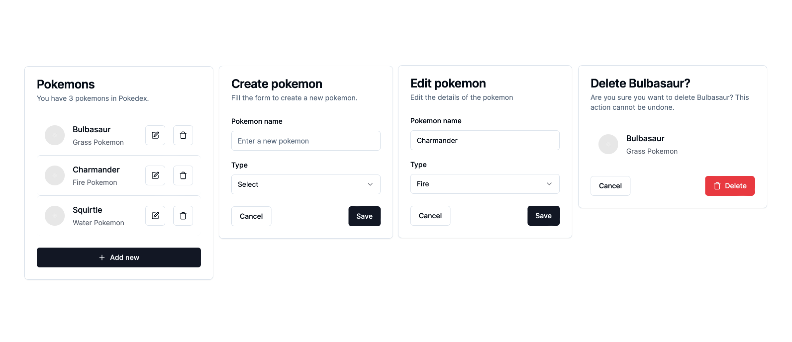

# Next Workshop



# Commands

```bash
pnpm i
pnpm dev
```

# Features

- [x] [App router navigation](https://nextjs.org)
- [x] [Shadcn components](https://ui.shadcn.com/docs/installation/next)
- [x] TailwindCSS
- [x] [JSON Server](https://github.com/typicode/json-server)
- [x] CRUD operations
- [x] [Server Actions and Mutations](https://nextjs.org/docs/app/building-your-application/data-fetching/server-actions-and-mutations)
- [x] [Cache revalidation](https://nextjs.org/docs/app/building-your-application/data-fetching/fetching-caching-and-revalidating)
- [x] [Form validations](https://ui.shadcn.com/docs/components/form)
- [x] [Next Theme](https://ui.shadcn.com/docs/dark-mode/next)
- [x] [i18n](https://i18nexus.com/tutorials/nextjs/react-i18next)
- [ ] [Next Auth](https://authjs.dev/getting-started/installation?framework=next.js)
- [ ] Prisma
